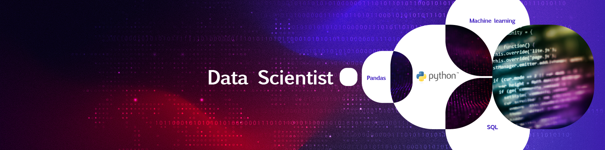

### ¡Hola! Soy Isabel 👋  
**Data Scientist junior** con formación en diseño, comunicación y experiencia en endomarketing.  
Apasionada por los datos, la creatividad y el aprendizaje constante.

📂 Aunque mis proyectos aún son pocos, cada uno está diseñado para abordar problemas reales con un enfoque riguroso y completo. Como perfil junior, me esfuerzo por que cada entrega refleje no solo lo aprendido, sino también mi capacidad analítica, sentido estético y experiencia en visual thinking para comunicar hallazgos de forma clara y efectiva.

🧠 Interesada en:  
- Machine Learning  
- Visualización de datos  
- Visual thinking aplicado a la ciencia de datos  
- Inteligencia artificial ética  
- Endomarketing basado en datos  

📫 Conecta conmigo en [LinkedIn](https://www.linkedin.com/in/isabelcastro-ds/)

## 🧠 Hard Skills

### 🛠️ Lenguajes y manipulación de datos  

### 📊 Visualización de datos  

### 🤖 Machine Learning  

### 🧠 Deep Learning  

### 🧰 Entornos y herramientas  

